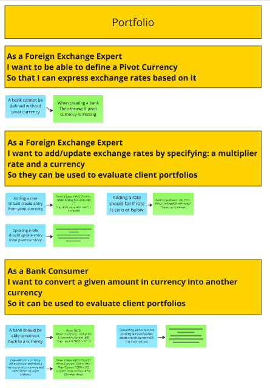

# Example Mapping



## Format de restitution
*(rappel, pour chaque US)*

```markdown
## Titre de l'US (post-it jaunes)

> Question (post-it rouge)

### Règle Métier (post-it bleu)

Exemple: (post-it vert)

- [ ] 5 USD + 10 EUR = 17 USD
```

Vous pouvez également joindre une photo du résultat obtenu en utilisant les post-its.

## Story 1: Define Pivot Currency

```gherkin
As a Foreign Exchange Expert
I want to be able to define a Pivot Currency
So that I can express exchange rates based on it
```

### A bank connot be defined without pivot currency

Exemple :

- When creating a bank Then throws if pivot currency is missing

## Story 2: Add an exchange rate
```gherkin
As a Foreign Exchange Expert
I want to add/update exchange rates by specifying: a multiplier rate and a currency
So they can be used to evaluate client portfolios
```
### Adding a rate should create entry from pivot currency

Exemple:

- Given a bank with USD pivot. When Adding EUR with rate 1.1
Then EUR entry with rate 1.1 is created

### Updating a rate should update entry from pivot currency

Exemple:

- Given a bank with USD pivot & EUR rate is 1.1
When Updating EUR with rate 1.2
Then EUR entry with rate 1.1 is updated to 1.2

### Adding a rate should fail if rate is zero or below

Exemple : 

- Given a bank with USD pivot.
When Adding EUR with rate 0
Then Error is thrown


## Story 3: Convert a Money

```gherkin
As a Bank Consumer
I want to convert a given amount in currency into another currency
So it can be used to evaluate client portfolios
```

### A bank should be able to convert back to a currency

Exemple:

- Given 1USD,
When converting 1USD->EUR & converting back to USD
Then result is 1USD +-10^-4

### Converting to a currency different from pivot should convert to pivot currency and then convert to target currency

Exemple:

- Given a bank with USD pivot.
When Convert 1EUR->KRW : 
Then Convert 1EUR->USD
Convert amount-USD->KRW (2 conversions)


### Converting with a rate not existing but inverse rate exists should convert with the inverted rate

Exemple:

- Given a bank with USD pivot &
USD->EUR rate.
When Convert 1EUR->USD : 
Then Conversion should equal amount*(USD->EUR)^-1


